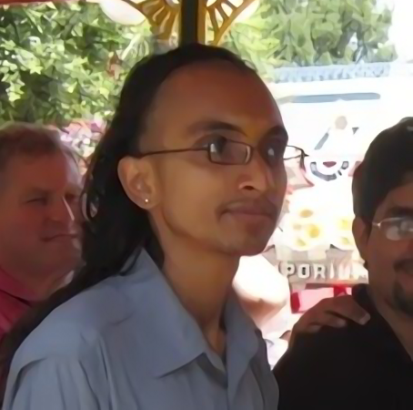

हरिः ॐ! स्वागतम्!

{title="Roughly 2013" class="thumbnail"}

Why are you here? Probably for one of the following reasons:

- You just want to check me and my interests out.
  - If so, welcome - click around.
- You're interested in me as a contributor to sanskrit (shAstra/ kAvya ...) learning and processing.
  - Oh, you're more likely to be in luck. Look around. But you'll probably not find my best work here. Instead head over to [github](https://github.com/vvasuki) (especially the coder organizations I participate in) and the mailing lists. And checkout [dyugangA](https://sanskrit.github.io/groups/dyuganga/).
  - If you want to contribute (ie publish online) some digitized text - please contact me.
- You're interested in my views on certain topics. If so -
  - There will be loads of public notes (with books and articles I've gathered/ annotated) at multiple sites such as [AgamaH_vaiShNavaH](AgamaH_vaiShNavaH/) and [notes](notes/) sites (use the sidebar/ topbar to navigate).
  - My most valuable thoughts, which I hope will **survive beyond my body's demise**, especially in my progeny 
    - [साङ्गणक-दर्शनं वैश्वासम्](/AgamaH/AryaH/hinduism/branches/sAngaNakaH/vaishvAsam/)
    - [post-electronic-archive](https://rebrand.ly/dg-archive) - very important project
    - Presentations [here](/kriyA-nishchayaH/meta-ritual/presentations/), esp. [prajNA-dhArAH](/kriyA-nishchayaH/meta-ritual/presentations/praJNA-dhArAH_saMskRtaM).
    - [विश्वास-नित्य-स्मृतिः](/kAvyam/laxyam/padyam/vishvAsaH/saMyamaH/vishvAsa-nitya-smRtiH)
  - In some sensitive cases (rituals, politics, etc..) you'll mostly find opinions attributed to others. My frankest observations remain hidden, as they must be in societies lacking honesty and free speech. Suffice to say: "नारायण-परा वयम्"। Even so: अतिपरिचयात् अवज्ञा। So, be wary of forming strong opinions based on these pages.
- You're interested in me as a computer programmer or researcher.
  - If so, yes I am an engineer. I worked in some fancy corporations of my time, and graduated from the Computer Science department of the University of Texas at Austin with an MS in Computer Science. I keep engineering software for the sanskrit community and my text/ audio curation needs. You'll find my CV and details somewhere on this site.

Like most people, I have dreams and a non-insignificant potential for good. 

Pretentious intros

Some pretentious intros I originally wrote for myself in the third person for some lectures:

विश्वासो वासुकिपुत्रो जामदग्न्यो
भगवत्कैङ्कर्यैकरसिको गृहस्थाश्रमोचितैः पञ्चमहायज्ञैर् यथाशास्त्रं यथाशक्ति च सोल्लासं भारतवर्षे कर्णाटेषु कल्याणपुर्यां वर्तमानः,  
भगवत्प्रीत्यर्थं स्वाधीत्यै स्वापत्यादिशिक्षणानुकूल्याय च  
द्युगङ्गाख्येन प्राचीनग्रन्थोद्धारप्रकाशनोद्यमं https://sanskrit.github.io/groups/dyuganga/ इत्यत्र दृश्यमानं चालयन्  
यथासम्भवं सज्जनसहकारं भगवदनुमतं काङ्क्षते।  
सम्प्रदायाद्यभिनिवेशं विना प्रमाणपरतन्त्रतया शास्त्रकाव्याद्यनुसन्धाने विशिष्टा रुचिः।  
ततो विस्तारो ऽत्र - https://vishvasa.github.io/ ।

Vishvāsa, son of Vāsuki, is a practicing Hindu, a lover of both hard rationality and tender aesthetic sensitivity. He is content following the three life-values (puruṣartha-s), cognizant of his gratitude towards the deva-s, sages, his ancestors, society and nature at large. He spends much of his free time learning, propagating and adding to saṃskṛta shāstra-s and kāvya-s - especially see https://sanskrit.github.io/groups/dyuganga/. He also follows and occassionally debates on a wide variety of issues affecting the Hindu ethos and humanity in general. He speaks Saṃskṛtam, Kannaḍa, Hindī, Hebbār Tamiḷ and English - in roughly that order of preference. Originally from southern Karnāṭaka, his body is borne by the ??? area. He was a professional computer programmer, and has sampled academic research - and occasionally utilizes those skills for his projects. Other interests include snowboarding, music, films, hiking, web surfing etc.. He organizes some of his thoughts at [vishvAsa.github.io](http://vishvAsa.github.io) and welcomes comments and criticism.

श्रीवैष्णवेषु परिचयः

दादस्य मे नाम विश्वास इति।  
कल्याणपुर्यां वासः, गृहस्थः,  
काञ्चीतातार्येभ्यो लब्धपञ्चसंस्कारः,  
सारसारज्ञ-राजगोपालार्य-सुत-लक्ष्मीनृसिंह-च्छात्रश् च।  

श्रीवैष्णवग्रन्थानाम् उट्टङ्क्यान्तर्जाले मादृश-भागवत-प्रयोजनाय रक्षणेनानुज्ञाकैङ्कर्ये दासस्याभिनिवेशः।  

